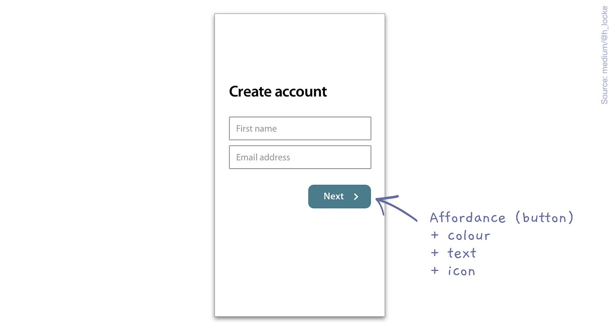

# First Journal Entry...

## Leveling Up with Catalyst: My Personal Growth Adventure

Hey Guys! I have recently embarked on an exploration of self-improvement applications, and my journey has been nothing short of enlightening. Allow me to share with you my experience with Catalyst, a sophisticated tool meticulously crafted to assist individuals in establishing and achieving personal goals, cultivating positive habits, and ultimately enhancing the quality of their lives.

I'm lounging on my couch, feeling a bit stuck, when I discover Catalyst. Its sleek design and user-friendly prompts convince me to give it a shot. I dive in and set a goal: to exercise regularly. Catalyst guides me through questions, acting like a virtual coach. Once I've set my goal, it offers me helpful resources like habit trackers and motivational articles to keep me on track.

After a week of using the app, I'm feeling great. Catalyst excells keeping me accountable and motivated. I've not only hit the exercise targets I have set, but have smashed them. I've never felt so pumped about working out! Catalyst hits it out of the park it when it comes to making self-improvement feel like a breeze. The app's ease of use, and it's personalized touches make you feel like it's got your back every step of the way. Plus, those badges? They're like little high-fives that keep you coming back for more.

But the app is not perfect and there are some issues. For example, sometimes the app can be a bit slow to update, especially when it comes to tracking your habits. But still, the overall vibe of Catalyst is so positive and motivational that you can't help but overlook the occasional glitch.

In terms of **efficiency**, Catalyst could streamline its habit-tracking feature to provide more real-time **feedback**. Waiting for updates can sometimes slow down the momentum, so improving the speed and responsiveness of the app would make the experience even smoother.

When it comes to **effectiveness**, Catalyst hits the mark by providing users with clear guidance and tools to achieve their goals. The **mapping** between setting a goal and accessing relevant resources is intuitive, making it easy for users to navigate the app and stay on track.

Moreover, Catalyst's use of **affordance**,those visual cues that suggest how an element should be used, makes it a breeze to interact with. Buttons are clearly labeled, and prompts guide you along the way, creating a seamless user experience.

And let's not forget about **satisfaction**! Catalyst truly excels in this department, offering a rewarding experience that leaves you feeling accomplished and motivated. Those virtual badges? They're like little rewards that make all your hard work feel worthwhile.

To enhance its UX/UI, Catalyst could first address technical glitches and introduce additional options for customizing goals. Moreover, providing users with more tools to tailor content would not only boost user engagement but also bridge the gap between their **mental model** and the **conceptual model** of the app's functionality. The **mental model** reflects users' preconceived notions and expectations, shaped by past experiences with similar apps, while the **conceptual** model pertains to the underlying structure and organization of Catalyst's features.

Despite these potential enhancements, Catalyst has proven indispensable in my journey. Its UI operates as a virtual motivation coach, seamlessly guiding users toward self-improvement while aligning with their mental models of familiar app interactions and conceptual models of Catalyst's functionality. As I progress along this path, Catalyst will undoubtedly remain a valuable companion, facilitating my growth with its user-friendly interface and robust features.
